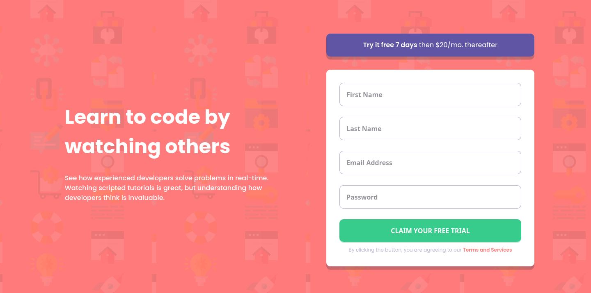

# Frontend Mentor - Intro component with sign up form solution

This is a solution to the [Intro component with sign up form challenge on Frontend Mentor](https://www.frontendmentor.io/challenges/intro-component-with-signup-form-5cf91bd49edda32581d28fd1). Frontend Mentor challenges help you improve your coding skills by building realistic projects. 

## Table of contents

- [Overview](#overview)
  - [The challenge](#the-challenge)
  - [Screenshot](#screenshot)
  - [Links](#links)
- [My process](#my-process)
  - [Built with](#built-with)
  - [What I learned](#what-i-learned)
  - [Continued development](#continued-development)
  - [Useful resources](#useful-resources)
- [Author](#author)
- [Acknowledgments](#acknowledgments)

## Overview

### The challenge

Users should be able to:

- View the optimal layout for the site depending on their device's screen size
- See hover states for all interactive elements on the page
- Receive an error message when the `form` is submitted if:
  - Any `input` field is empty. The message for this error should say *"[Field Name] cannot be empty"*
  - The email address is not formatted correctly (i.e. a correct email address should have this structure: `name@host.tld`). The message for this error should say *"Looks like this is not an email"*

### Screenshot



### Links

- Solution URL: [Solution](https://github.com/AlexdelCarmen/intro-component-with-signup-form)
- Live Site URL: [Live site](https://alexdelcarmen.github.io/intro-component-with-signup-form/)

## My process

As usual, I created the HTML structure first, next I added some custom CSS styles, then proceeded to style the mobile layout for the website. I continued by coding the script to trigger the error messages. I ended with making a simple media query to support desktop layouts.  
### Built with

- Semantic HTML5 markup
- CSS custom properties
- Flexbox
- Mobile-first workflow
- Vanilla JavaScript.

### What I learned

Using forEach in JS to access several similar elements without creating additional variables:

```js

submitButton.addEventListener("click", () => {
  formInputs.forEach((input) => {
    if (input.childNodes[1].type === "email") {
      if (
        input.childNodes[1].value.match(
          /^(([^<>()[\]\.,;:\s@\"]+(\.[^<>()[\]\.,;:\s@\"]+)*)|(\".+\"))@(([^<>()[\]\.,;:\s@\"]+\.)+[^<>()[\]\.,;:\s@\"]{2,})$/i
        ) === null
      ) {
        input.childNodes[1].classList.add("error");
        input.childNodes[3].classList.remove("hidden");
        input.childNodes[5].classList.remove("hidden");
      } else {
        input.childNodes[1].classList.remove("error");
        input.childNodes[3].classList.add("hidden");
        input.childNodes[5].classList.add("hidden");
      }
    } else {
      if (input.childNodes[1].value === "") {
        input.childNodes[1].classList.add("error");
        input.childNodes[3].classList.remove("hidden");
        input.childNodes[5].classList.remove("hidden");
      } else {
        input.childNodes[1].classList.remove("error");
        input.childNodes[3].classList.add("hidden");
        input.childNodes[5].classList.add("hidden");
      }
    }
  });
});


```

### Continued development

Still got to practice more my responsive layouts.  

- [W3Schools article on multiple backgrounds on an HTML element](https://www.w3schools.com/css/) - General CSS reference.


## Author

- Website - [Github Profile](https://github.com/AlexdelCarmen)
- Frontend Mentor - [@AlexdelCarmen](https://www.frontendmentor.io/profile/AlexdelCarmen)
- Twitter - [@AlekBorchov](https://twitter.com/AlekBorchov)

## Acknowledgments

To mom, I'll get you out one day.  
